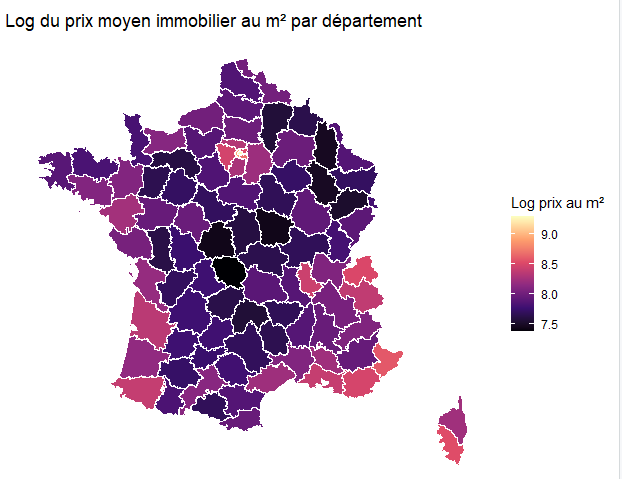
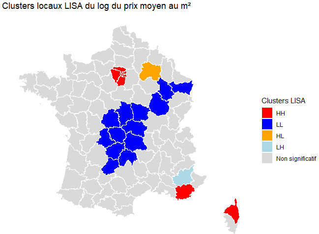
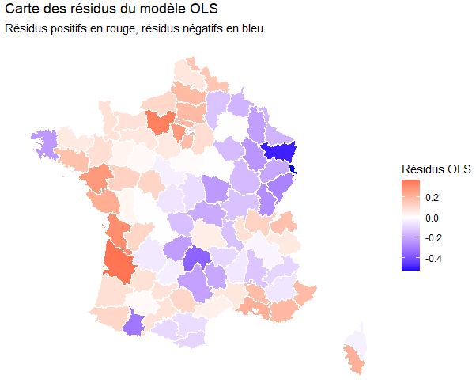
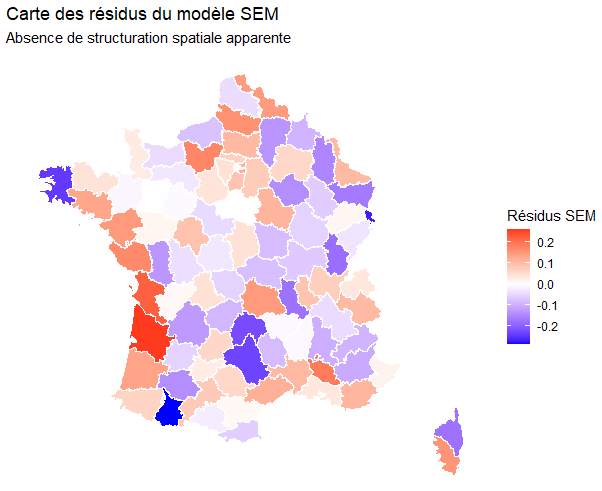

# Dépendance spatiale des prix immobiliers en France

*Spatial econometrics on French real estate prices — Moran's I, LISA clusters, and a Spatial Error Model across 93 départements. English summary below.*

Projet réalisé dans le cadre du Master 2 Data Analyst (IAE Paris-Est,
Université Gustave Eiffel).

## Problématique

Dans quelle mesure les prix immobiliers présentent-ils une dépendance
spatiale entre les départements français, et quels facteurs locaux du
marché immobilier permettent d'expliquer ces variations ?

## Données

Base construite à l'échelle départementale (93 départements métropolitains)
par croisement de plusieurs sources publiques :

- **DVF 2022** (Demandes de Valeurs Foncières) — transactions résidentielles
  (maisons et appartements), nettoyées puis agrégées par département :
  prix moyen au m², surface moyenne, nombre de pièces moyen, part de
  maisons, nombre de transactions
- **INSEE** — population départementale 2022
- **INSEE / DARES** — taux de chômage moyen 2022 (moyenne des 4 trimestres)
- **INSEE** — fréquentation touristique 2022 (nuitées), rapportée à la
  population pour obtenir une intensité touristique
- **IGN** (ADMIN-EXPRESS) — fond de carte départemental, pour le calcul de
  la superficie, de la densité de population et de la matrice de voisinage

La variable expliquée est le logarithme du prix moyen au m². Le détail des
sources et un jeu de données agrégé prêt à l'emploi sont dans
[`data/`](data/).

## Démarche

1. **ESDA** (Exploratory Spatial Data Analysis) — statistiques descriptives,
   distributions, cartographie des variables clés
2. **Matrice de pondération spatiale** — contiguïté de type Queen (93
   départements, 460 liens, 4,95 voisins en moyenne)
3. **Autocorrélation spatiale globale** — indice de Moran sur le log du prix
4. **Autocorrélation locale** — indicateurs LISA, identification de clusters
   significatifs
5. **Modèle de référence** — régression linéaire (OLS)
6. **Diagnostic de spécification spatiale** — tests du multiplicateur de
   Lagrange (LM), standards et robustes, pour arbitrer entre dépendance
   dans la variable (SAR) et dépendance dans les erreurs (SEM)
7. **Modèle retenu** — Spatial Error Model (SEM), validé par le test de
   Moran sur les résidus
8. **Analyse complémentaire** — Spatial Durbin Model (SDM), décomposition
   des effets directs / indirects (débordement spatial)

## Résultats clés

L'indice de Moran global sur le log du prix moyen au m² est **fortement
positif et significatif** (I = 0,562 ; p < 0,01) : les départements à prix
élevés sont géographiquement regroupés, et inversement.



Les indicateurs LISA confirment cette structuration à l'échelle locale : 9
départements en cluster High-High, 13 en Low-Low, et deux départements en
situation atypique (High-Low / Low-High).



Le modèle OLS de référence (R² ajusté = 0,714) laisse des résidus
spatialement autocorrélés (Moran = 0,501 ; p < 0,01) — signe d'une
mauvaise spécification :



Les tests LM robustes orientent vers une dépendance logée dans le terme
d'erreur plutôt que dans la variable dépendante. Le modèle SEM retenu
élimine cette autocorrélation résiduelle (Moran des résidus non
significatif : I = -0,037 ; p = 0,65) et améliore nettement l'ajustement
(AIC : OLS -41,0 → SEM -99,5) :



Le paramètre spatial du modèle SEM est fortement significatif
(λ = 0,81 ; p < 0,01). Parmi les facteurs locaux, l'intensité touristique
et la part de maisons dans le parc (effet négatif) ressortent comme les
déterminants les plus robustes du prix au m², la densité de population
ayant un effet positif plus marginal une fois la dépendance spatiale
contrôlée.

## Stack technique

R — `data.table`, `sf`, `spdep`, `spatialreg`, `ggplot2`, `dplyr`,
`viridis`, `classInt`.

## Structure du dépôt

```
├── report/
│   └── Projet_Geodata_M2.pdf        # rapport complet
├── script/
│   └── analyse_spatiale_immobilier.R
├── data/
│   ├── README.md                    # sources et instructions de reproduction
│   ├── dep_data_tabular.csv         # base agrégée (hors composante géographique)
│   └── build_tabular_dataset.py     # reproduction Python de l'agrégation
└── images/
```

---

## English summary

This project studies whether French real-estate prices exhibit spatial
dependence across the 93 metropolitan départements, and which local market
factors explain price variation. Built from DVF transaction data (2022)
joined with INSEE population, unemployment and tourism statistics and an
IGN administrative boundary layer, the analysis runs a full spatial
econometrics workflow in R: exploratory spatial data analysis, a queen
contiguity weights matrix, global (Moran's I) and local (LISA) spatial
autocorrelation tests, Lagrange Multiplier diagnostics to arbitrate between
a Spatial Lag (SAR) and Spatial Error (SEM) specification, and a
complementary Spatial Durbin Model to decompose direct and spillover
effects. The retained SEM model (λ = 0.81, p < 0.01) removes the residual
spatial autocorrelation present in the baseline OLS model and substantially
improves model fit (AIC -41.0 → -99.5).
